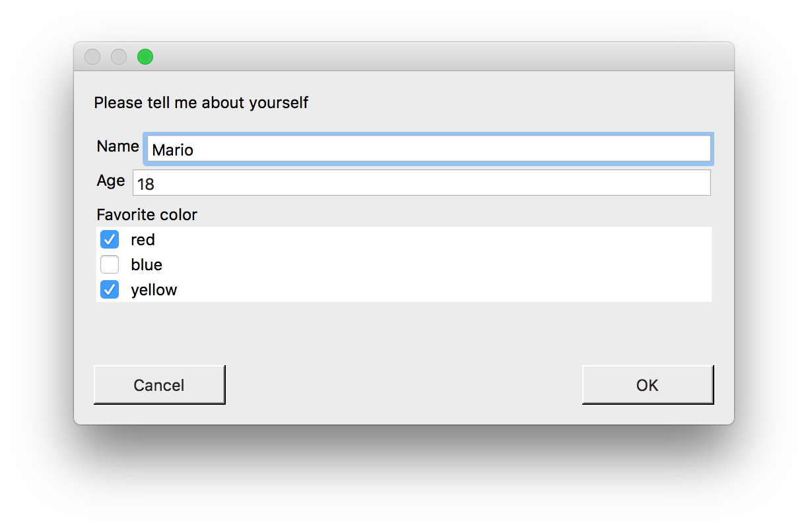

# EasyDialogs

_EasyDialogs_ simplifies the task of programmatically creating forms and input dialogs on _macOS_.

The focus is on ease of use for the developer rather than customization or beautiful controls. As such, the intended use is for the quick creation of internal tools rather than consumer applications. But don't let me stop you if that's your goal :-)

This library provides input dialogs for text, numbers, dropdown, multiple selection and more. All controls are intended to be created programmatically, i.e. without using interface builder.

The library offers two different approaches to asynchronicity: one based on closures (callbacks), and one based on futures.

## Example



To create a modal form window like the one seen in the screenshot, all you need is this code:

```swift        
let nameInput = TextFieldInput<String>(
    label: "Name",
    validationRules: [Validation.NotEmptyString().any]
)

let ageInput = TextFieldInput<Int>(
    label: "Age",
    value: 18,
    validationRules: [Validation.Custom({$0 != nil && $0! >= 0 && $0! < 200}).any]
)

let colorInput = MultipleSelectionInput(
    label: "Favorite color",
    possibleValues: ["red", "blue", "yellow"]
)

FormWindow<(colors: String, name: String, age: Int)>.displayForm(
    inputs: [
        nameInput,
        ageInput,
        colorInput
    ],
    headerText: "Please tell me about yourself",
    validateValue: {
        let colors = colorInput.value!.isEmpty ? "no color" : colorInput.value!.joined(separator: ", ")
        guard let name = nameInput.value else { return nil }
        guard let age = ageInput.value else { return nil }
        return (colors: colors, name: name, age: age)
    },
    onConfirm: {
        print("\($0.name), age \($0.age), likes \($0.colors)")
    }
)
```

## Documentation
Documentation can be found in the [docs](docs) folder.

